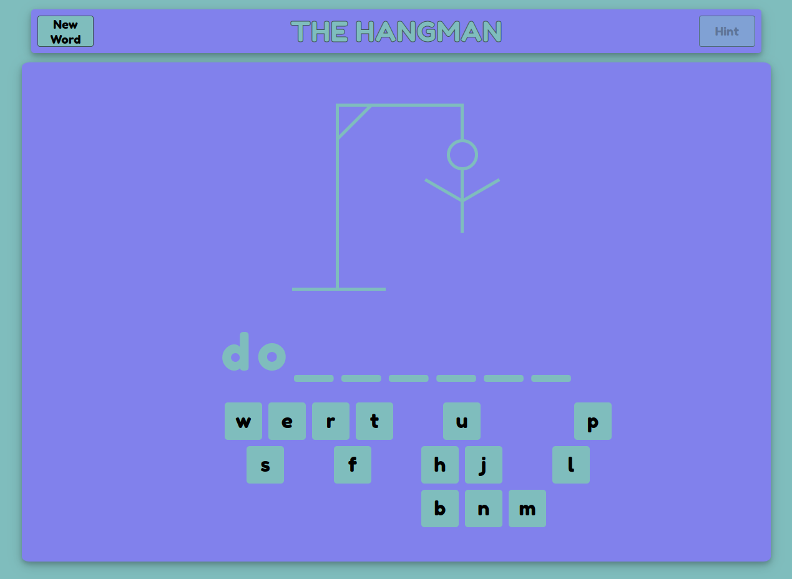

# HANGMAN GAME WHIT REACT

**Hangman is a guessing game of animal names.The word to guess is represented by a row of dashes representing each letter of the word.If the player suggests a letter which occurs in the word, It is written in all its correct positions. If the suggested letter does not occur in the word, it is added one element of a hanged stick figure as a tally mark. The game ends once the word is guessed, or if the stick figure is complete.**

---

## Knowledges:

- ReactJS

---

## How to use:

To clone and run this application, you'll need [Git](https://git-scm.com/downloads) and [ReactJS](https://reactjs.org/) installed on your computer. From your command line:

```bash

git clone https://github.com/Moabbasi378/Hangman


cd Hangman


npm install


npm start

```

---

## Demo:

- [Click Here](https://strong-smakager-afa0f1.netlify.app/) to see and play by yourself a demo of the game.

## 

---

## Contact:

- [E-mail](mailto:carloinred@gmail.com)
